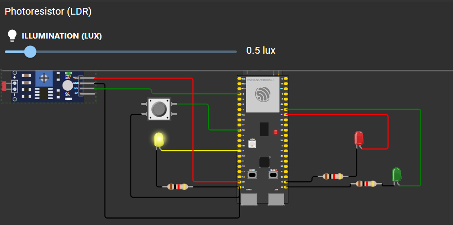
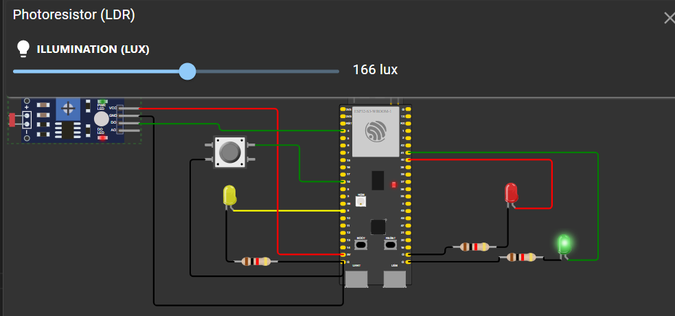
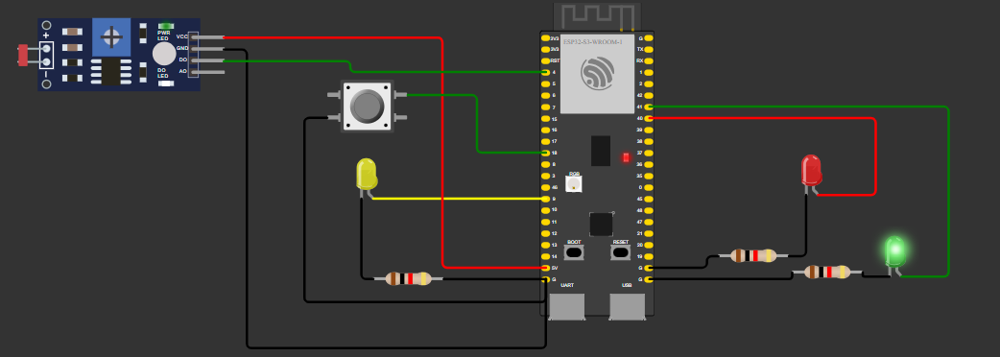
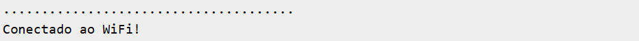
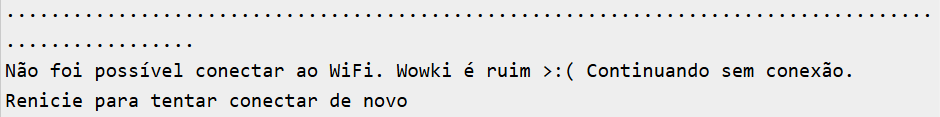

# Prova Modulo 4

Este documento descreve os estados principais do sistema de semaforo da parte do wokwi da prova. Cada estado representa uma situação específica do comportamento do sistema.

## 1. Modo Noturno
### Descrição:
- O sistema entra no **Modo Noturno** quando a leitura do sensor LDR indica que o ambiente está **escuro** (valor da leitura é menor ou igual ao limiar `LIMIAR_LDR`).
- Nesse estado, apenas o LED amarelo pisca.

### Comportamento:
- **LED verde:** Apagado.
- **LED vermelho:** Apagado.
- **LED amarelo:** Pisca com intervalo de 500ms.

---

## 2. Modo Convencional
### Descrição:
- O sistema entra no **Modo Convencional** quando a leitura do sensor LDR indica que o ambiente está **claro** (valor da leitura é maior que `LIMIAR_LDR`).
- Nesse estado, o sistema simula um semáforo com alternância dos LEDs verde, amarelo e vermelho.

### Comportamento:
- **LED verde:** Acende por 3 segundos.
- **LED amarelo:** Acende por 2 segundos.
- **LED vermelho:** Acende por 5 segundos.

---

## 3. Botão Pressionado
### Descrição:
- O botão pode ser pressionado em qualquer modo (noturno ou convencional) para executar ações adicionais.
- O comportamento do botão depende do número de pressões e do modo atual do sistema.

### Comportamento:
- **Modo Noturno:** Apenas registra a pressão no monitor serial, sem ações adicionais.
- **Modo Convencional:**
  - Pressionado 1 vez: Abre o semáforo após 1 segundo (LED vermelho apaga e o LED verde acende).
  - Pressionado 3 vezes consecutivas: Envia uma requisição HTTP para o servidor configurado.

  

---

## 4. Tentativa de Conexão WiFi
### Descrição:
- Durante o `setup`, o sistema tenta conectar à rede WiFi por até 10 segundos.
- Se não conseguir conectar, exibe uma mensagem no monitor serial e continua operando sem conexão.

### Comportamento:
- **WiFi conectado:** Permite o envio de requisições HTTP.

- **WiFi não conectado:** Exibe mensagem "Continuando sem conexão" e apenas executa os estados locais.
